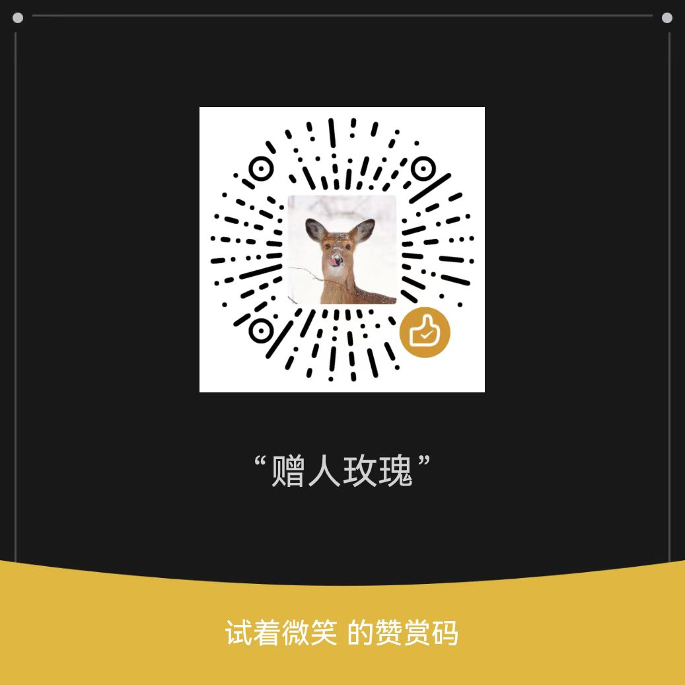

# Paper AI - 论文爬取与智能分析系统

一个自动化的 Arxiv 论文爬取、过滤、总结和展示系统，包含后端爬虫服务、Web API 服务和前端展示界面。

## 📋 项目简介

Paper AI 是一个完整的论文管理和分析系统，主要功能包括：

- 🔍 **自动爬取**: 从 Arxiv 自动爬取指定分类的最新论文
- 🧠 **智能过滤**: 支持关键词过滤和语义理解过滤
- 📝 **AI 总结**: 使用大模型对论文进行结构化总结
- 🌐 **Web 服务**: 提供 RESTful API 接口
- 💻 **前端界面**: Vue 3 构建的现代化前端界面
- 📊 **数据统计**: 提供论文统计和数据分析功能

## 📁 项目结构

```
paper_ai/
├── paper_ai_enhanced/      # 后端服务（爬虫 + Web API）
│   ├── src/                # 核心源代码
│   │   ├── crawler/        # 论文爬取模块
│   │   ├── core/           # 核心业务逻辑（过滤、存储、总结）
│   │   ├── api/            # API 客户端封装
│   │   ├── config/         # 配置管理
│   │   └── main.py         # 爬虫主程序
│   ├── server/             # FastAPI Web 服务
│   │   └── main.py         # API 服务器
│   ├── config.yaml         # 配置文件
│   ├── requirements.txt    # Python 依赖
│   ├── start_server.sh     # 后端启动脚本
│   └── README.md           # 后端详细文档
├── paper_ai_frontend/      # 前端应用
│   ├── src/                # Vue 源代码
│   │   ├── api/            # API 接口封装
│   │   ├── components/     # 组件
│   │   ├── views/          # 页面视图
│   │   └── router/         # 路由配置
│   ├── package.json        # Node.js 依赖
│   ├── vite.config.js      # Vite 配置
│   └── README.md           # 前端详细文档
├── start.sh                # 一键启动脚本（Linux/macOS）
├── start.bat               # 一键启动脚本（Windows）
└── README.md               # 项目文档（本文件）
```

## 🚀 快速开始

### 5 分钟快速体验

1. **克隆项目**（如果还没有）
   ```bash
   git clone <repository-url>
   cd paper_ai
   ```

2. **一键启动**
   ```bash
   # Linux/macOS
   ./start.sh
   
   # Windows
   start.bat
   ```

3. **访问服务**
   - 前端界面: http://localhost:5173
   - API 文档: http://localhost:8000/ai_paper/docs

就这么简单！脚本会自动处理所有依赖安装和环境配置。

### 环境要求

#### 后端环境
- **Python**: >= 3.8
- **pip**: 最新版本

#### 前端环境
- **Node.js**: >= 16.0.0 (推荐 18.x 或更高)
- **npm**: >= 8.0.0 (或使用 yarn/pnpm)

#### 系统要求
- **Linux/macOS**: 支持 bash 脚本
- **Windows**: 支持 PowerShell 或 CMD（可使用 `start.bat`）

### 一键启动（推荐）

项目提供了便捷的一键启动脚本，可以同时启动后端和前端服务：

#### Linux/macOS

```bash
# 给启动脚本添加执行权限（首次使用，如果还没有）
chmod +x start.sh

# 启动所有服务
./start.sh

# 停止所有服务
./start.sh stop

# 查看服务状态
./start.sh status
```

#### Windows

```cmd
# 启动所有服务
start.bat

# 停止所有服务
start.bat stop

# 查看服务状态
start.bat status
```

启动脚本会自动：
1. ✅ 检查 Python 和 Node.js 环境
2. ✅ 检查并创建 Python 虚拟环境（如果不存在）
3. ✅ 安装后端依赖（如果未安装或已更新）
4. ✅ 启动后端 API 服务（端口 8000）
5. ✅ 检查并安装前端依赖（如果未安装或已更新）
6. ✅ 创建前端环境变量文件（如果不存在）
7. ✅ 启动前端开发服务器（端口 5173）

**注意**：
- 首次运行会自动安装所有依赖，可能需要几分钟时间
- 如果端口 8000 或 5173 已被占用，脚本会提示但不会强制停止现有服务
- 服务日志保存在 `/tmp/paper_ai_backend.log` 和 `/tmp/paper_ai_frontend.log`

### 手动启动

如果需要分别启动后端和前端，可以按照以下步骤操作：

#### 1. 后端服务启动

```bash
# 进入后端目录
cd paper_ai_enhanced

# 创建虚拟环境（如果还没有）
python3 -m venv venv

# 激活虚拟环境
source venv/bin/activate  # Linux/macOS
# 或
venv\Scripts\activate      # Windows

# 安装依赖
pip install -r requirements.txt

# 启动服务
./start_server.sh
# 或直接使用 uvicorn
uvicorn server.main:app --host 0.0.0.0 --port 8000 --reload
```

后端服务将在 `http://localhost:8000` 启动。

#### 2. 前端服务启动

```bash
# 进入前端目录
cd paper_ai_frontend

# 安装依赖
npm install

# 启动开发服务器
npm run dev
```

前端服务将在 `http://localhost:5173` 启动。

## ⚙️ 配置说明

### 后端配置

后端配置文件位于 `paper_ai_enhanced/config.yaml`，主要配置项包括：

#### 1. Arxiv 爬取配置

```yaml
arxiv:
  categories:          # 论文分类列表
    - "cs.AI"          # 人工智能
    - "cs.LG"          # 机器学习
    - "cs.CV"          # 计算机视觉
  max_results: 20      # 每次爬取的最大论文数
  days_back: 1         # 往前推多少天
```

#### 2. 过滤配置

```yaml
filter:
  enabled: true        # 是否启用过滤
  mode: "both"         # 过滤模式：keyword, semantic, both
  
  keyword:             # 关键词过滤
    enabled: true
    keywords:          # 关键词列表
      - "vulnerability"
      - "security"
    match_mode: "any"  # any: 匹配任意关键词, all: 匹配所有关键词
  
  semantic:            # 语义理解过滤
    enabled: true
    api_url: "https://open.bigmodel.cn/api/..."
    api_key: "your-api-key"
    model: "glm-4.5-flash"
```

#### 3. LLM 配置（论文总结）

```yaml
llm:
  enabled: true
  api_url: "https://open.bigmodel.cn/api/..."
  api_key: "your-api-key"
  model: "glm-4.5"
  timeout: 300
```

#### 4. 服务器配置

```yaml
server:
  api_prefix: "ai_paper"  # API 路径前缀
```

### 前端配置

前端通过环境变量配置，需要创建 `.env.development` 和 `.env.production` 文件：

#### 开发环境 (`.env.development`)

```env
# API 基础地址
VITE_API_BASE_URL=http://localhost:8000

# 部署路径
VITE_BASE_URL=/
```

#### 生产环境 (`.env.production`)

```env
# API 基础地址
VITE_API_BASE_URL=http://your-api-server:8000

# 部署路径
VITE_BASE_URL=/ai_paper/
```

## 📖 使用指南

### 运行论文爬取

```bash
cd paper_ai_enhanced

# 使用默认配置
python main.py

# 指定配置文件
python main.py --config config.yaml

# 自定义参数
python main.py --days 2 --max-results 50 --categories cs.AI cs.LG
```

### 访问服务

- **前端界面**: http://localhost:5173
- **后端 API**: http://localhost:8000
- **API 文档**: http://localhost:8000/ai_paper/docs

### API 接口

主要 API 接口：

- `GET /ai_paper/api/dates` - 获取所有可用日期
- `GET /ai_paper/api/papers` - 获取论文列表（支持日期、分类、关键词、作者筛选）
- `GET /ai_paper/api/papers/all` - 获取所有论文
- `GET /ai_paper/api/paper/{paper_id}` - 获取论文详情
- `GET /ai_paper/api/categories` - 获取所有分类
- `GET /ai_paper/api/stats` - 获取统计数据
- `GET /ai_paper/api/stats/daily` - 获取每日统计

详细 API 文档请访问：http://localhost:8000/ai_paper/docs

## 🛠️ 开发指南

### 后端开发

后端使用 FastAPI 框架，代码结构：

- `src/crawler/` - 论文爬取模块
- `src/core/` - 核心业务逻辑（过滤、存储、总结）
- `src/api/` - API 客户端封装
- `src/config/` - 配置管理
- `server/main.py` - FastAPI 服务器

### 前端开发

前端使用 Vue 3 + Vite，代码结构：

- `src/api/` - API 接口封装
- `src/components/` - 组件
- `src/views/` - 页面视图
- `src/router/` - 路由配置

### 构建生产版本

#### 后端

后端服务可以直接使用 uvicorn 运行，或使用 gunicorn 部署：

```bash
gunicorn server.main:app -w 4 -k uvicorn.workers.UvicornWorker --bind 0.0.0.0:8000
```

#### 前端

```bash
cd paper_ai_frontend

# 构建生产版本
npm run build

# 构建产物在 dist/ 目录
```

## 📦 部署

### Docker 部署（可选）

可以创建 Dockerfile 和 docker-compose.yml 进行容器化部署。

### Nginx 配置

前端部署到 Nginx 的配置示例请参考 `paper_ai_frontend/README.md`。

## 🔧 常见问题

### 1. 一键启动脚本执行失败

**问题**: `./start.sh: Permission denied`

**解决方案**:
```bash
chmod +x start.sh
./start.sh
```

**问题**: Windows 下 `start.bat` 无法运行

**解决方案**:
- 确保使用 CMD 或 PowerShell 运行
- 检查 Python 和 Node.js 是否已添加到系统 PATH

### 2. 后端启动失败

**问题**: Python 虚拟环境创建失败

**解决方案**:
- 检查 Python 版本：`python3 --version`（需要 >= 3.8）
- 确保已安装 `venv` 模块：`python3 -m pip install --upgrade pip`

**问题**: 端口 8000 被占用

**解决方案**:
```bash
# Linux/macOS: 查找占用端口的进程
lsof -i :8000

# Windows: 查找占用端口的进程
netstat -ano | findstr :8000

# 停止占用端口的进程，或修改配置文件中的端口
```

**问题**: 依赖安装失败

**解决方案**:
```bash
cd paper_ai_enhanced
source venv/bin/activate  # Linux/macOS
# 或 venv\Scripts\activate  # Windows
pip install --upgrade pip
pip install -r requirements.txt
```

### 3. 前端启动失败

**问题**: Node.js 版本不兼容

**解决方案**:
- 检查 Node.js 版本：`node --version`（需要 >= 16.0.0）
- 推荐使用 nvm 管理 Node.js 版本

**问题**: npm 安装依赖失败

**解决方案**:
```bash
cd paper_ai_frontend
# 清除缓存和旧依赖
rm -rf node_modules package-lock.json  # Linux/macOS
# 或 del /s /q node_modules package-lock.json  # Windows
npm cache clean --force
npm install
```

**问题**: 端口 5173 被占用

**解决方案**:
- 修改 `vite.config.js` 中的端口配置
- 或停止占用端口的其他服务

### 4. API 请求失败

**问题**: 前端无法连接到后端 API

**解决方案**:
- 检查后端服务是否正常运行：访问 http://localhost:8000/ai_paper/docs
- 检查 `.env.development` 文件中的 `VITE_API_BASE_URL` 配置
- 确保后端 CORS 配置正确（后端已默认允许所有来源）

**问题**: CORS 跨域错误

**解决方案**:
- 后端已配置允许所有来源，如果仍有问题，检查 `server/main.py` 中的 CORS 配置

### 5. 论文爬取失败

**问题**: 网络连接超时

**解决方案**:
- 检查网络连接
- 确认可以访问 Arxiv 网站
- 检查防火墙设置

**问题**: API 密钥错误

**解决方案**:
- 检查 `config.yaml` 中的 `llm.api_key` 和 `filter.semantic.api_key`
- 确保 API 密钥有效且有足够的配额

**问题**: 分类代码无效

**解决方案**:
- 查看 Arxiv 分类代码列表：https://arxiv.org/category_taxonomy
- 检查 `config.yaml` 中的 `arxiv.categories` 配置

### 6. 服务无法停止

**解决方案**:
```bash
# Linux/macOS
./start.sh stop

# 或手动停止
pkill -f "uvicorn server.main:app"
pkill -f "vite"

# Windows
start.bat stop

# 或手动停止
taskkill /F /IM python.exe
taskkill /F /IM node.exe
```

## 📝 数据存储

论文数据按日期组织存储在 `paper_ai_enhanced/data/` 目录：

```
data/
├── 2026-01-14/          # 按日期组织
│   ├── json/            # JSON 文件
│   ├── pdf/             # PDF 文件
│   ├── markdown/        # Markdown 总结
│   └── content/         # PDF 提取的文本内容
└── logs/                # 日志文件
```

## 📄 许可证

[根据项目实际情况填写]

## 🤝 贡献

欢迎提交 Issue 和 Pull Request！

## 📚 更多文档

- [后端详细文档](./paper_ai_enhanced/README.md) - 包含完整的后端 API 文档和配置说明
- [前端详细文档](./paper_ai_frontend/README.md) - 包含前端开发指南和部署说明

## 🛠️ 开发工具

### 推荐工具

- **IDE**: VS Code, PyCharm
- **API 测试**: Postman, Insomnia, 或直接访问 http://localhost:8000/ai_paper/docs
- **版本控制**: Git

### 开发命令速查

```bash
# 后端
cd paper_ai_enhanced
source venv/bin/activate  # 激活虚拟环境
python main.py            # 运行爬虫
uvicorn server.main:app --reload  # 启动开发服务器

# 前端
cd paper_ai_frontend
npm run dev      # 开发模式
npm run build    # 构建生产版本
npm run preview  # 预览生产构建
```

## 📝 更新日志

### v1.0.0 (2026-01)
- ✅ 初始版本发布
- ✅ 支持 Arxiv 论文自动爬取
- ✅ 支持智能过滤和 AI 总结
- ✅ 提供完整的 Web API 服务
- ✅ 提供现代化的前端界面
- ✅ 一键启动脚本支持

---

## ☕ 买杯奶茶（打赏）

如果这个项目对你有帮助，欢迎请作者喝杯奶茶～




---

**最后更新**: 2026年1月

